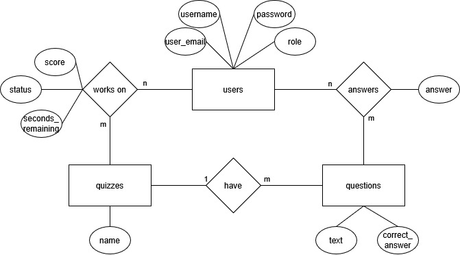
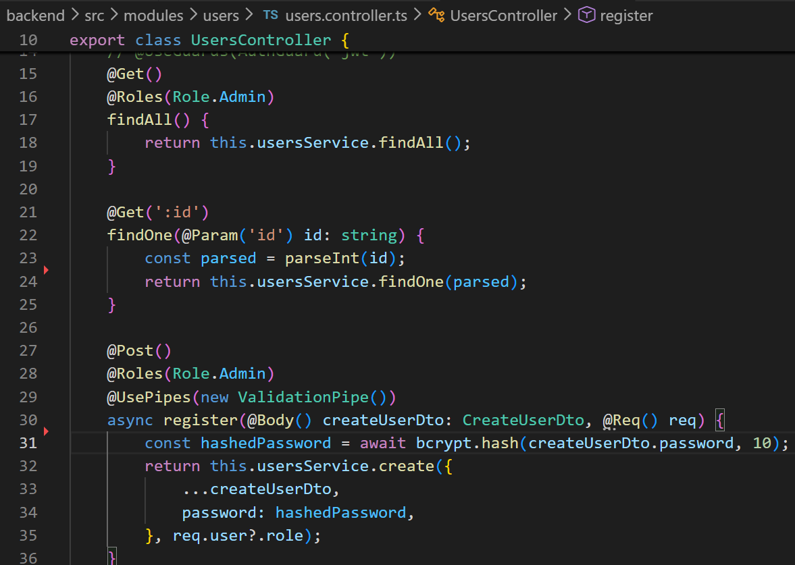
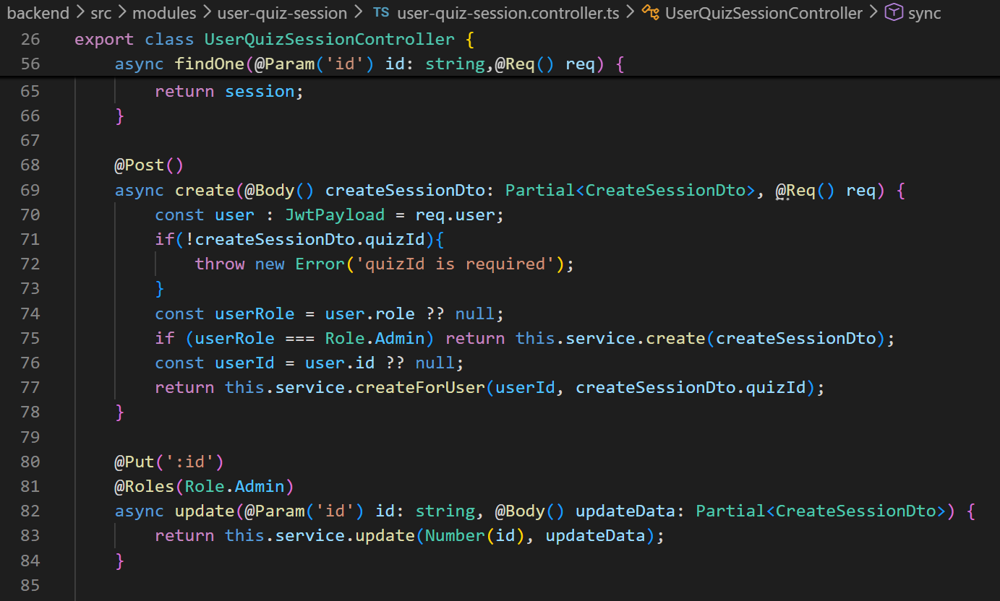
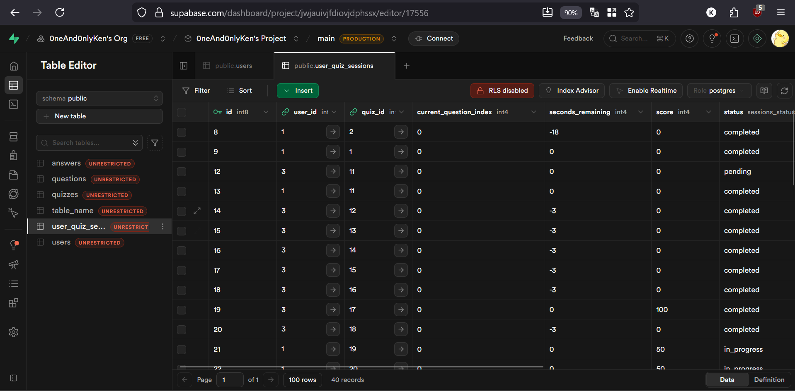
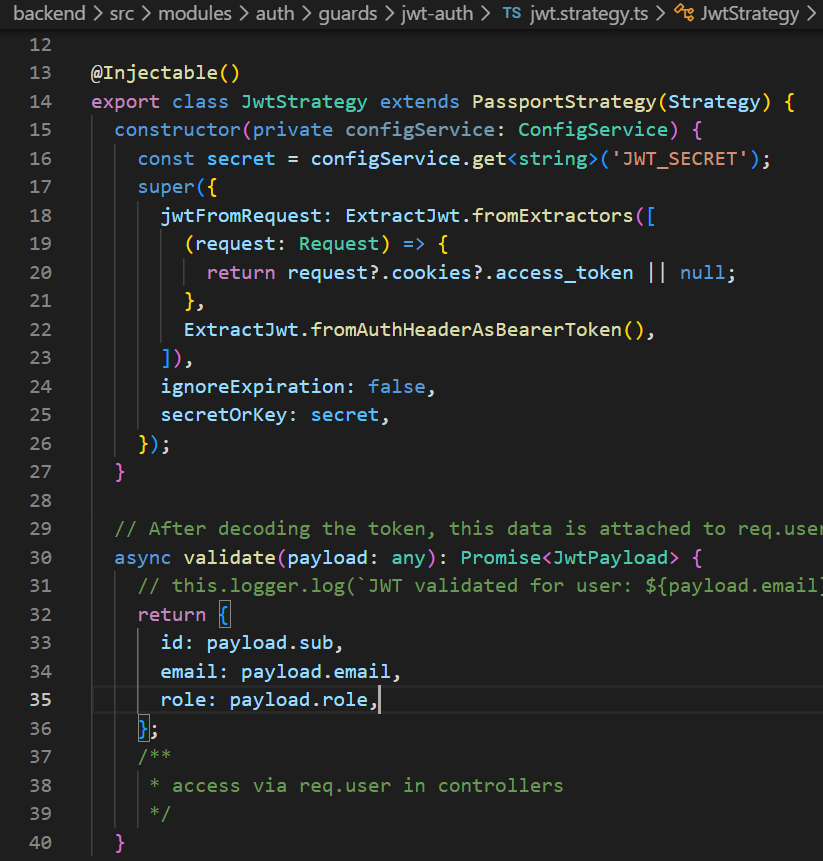
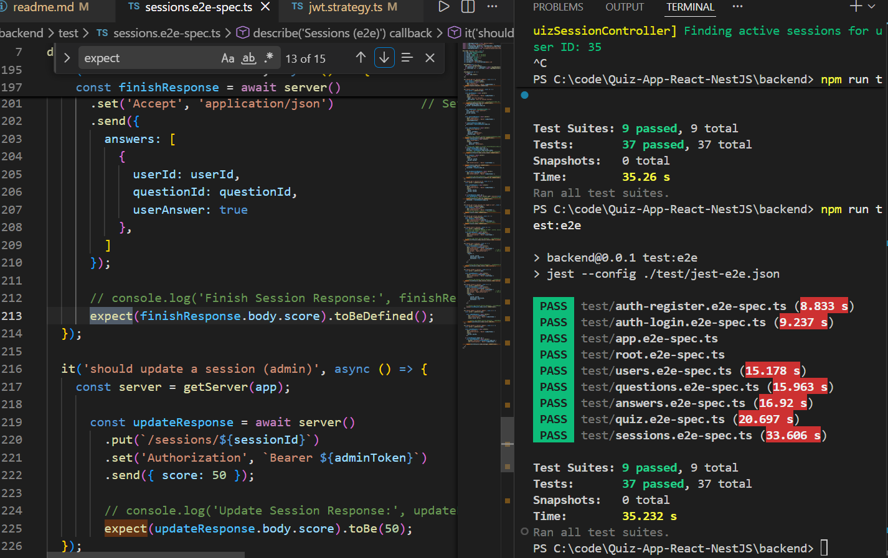
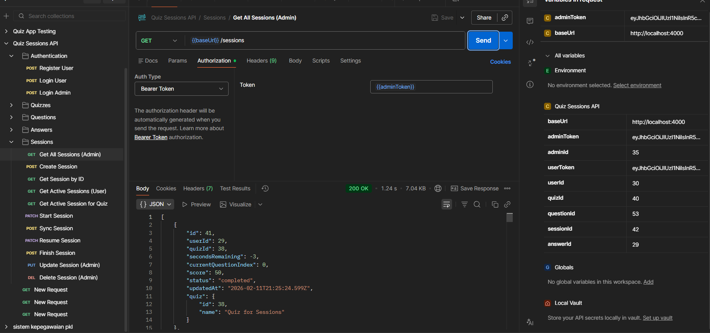

# Backend Quiz App - NestJS

## Deskripsi Proyek

Proyek ini adalah backend untuk aplikasi kuis interaktif yang dibangun menggunakan NestJS, sebuah framework Node.js untuk aplikasi server-side. Backend ini menyediakan API untuk mengelola kuis, pertanyaan, jawaban, pengguna, dan sesi kuis. Aplikasi ini menggunakan database SQL untuk penyimpanan data dan JWT untuk autentikasi.

Backend telah di deploy pada platform Railway pada berikut.
```
https://quiz-app-react-nestjs-production.up.railway.app/quiz
```

Berikut adalah entitas-entitas yang akan digunakan datanya dalam aplikasi. 



Terdapat entitas utama: `Users`, `Quiz`, `Questions`, `Answers`, dan `Sessions`.

Penjelasan ERD entitas dan atribut (ringkas):

- `Users`
	- `id` (PK): UUID atau integer unik.
	- `email`: string, unik, untuk login.
	- `username`: string, nama tampilan.
	- `passwordHash`: string, hasil hashing password.
	- `role`: enum (e.g., `User`, `Admin`).
	- `createdAt`, `updatedAt`: timestamp.
	- Relasi: satu `User` punya banyak `Sessions` dan banyak `Answers`.

- `Quiz`
	- `id` (PK)
	- `title`: judul kuis.
	- `description`: deskripsi singkat.
	- `createdAt`, `updatedAt`.
	- Relasi: satu `Quiz` memiliki banyak `Questions`; dapat memiliki banyak `Sessions`.

- `Questions`
	- `id` (PK)
	- `quizId` (FK -> `Quiz.id`): mengikat ke kuis.
	- `text`: isi pertanyaan.
	- `correctAnswer`: Jawaban yang benar yaitu true or false (disimpan di server, jangan kirim ke klien publik).
	- `createdAt`, `updatedAt`.

- `Answers`
	- `id` (PK)
	- `questionId` (FK -> `Questions.id`)
	- `userId` (FK -> `Users.id`) — kadang disimpan untuk audit
	- `selectedOption` / `answerText`: jawaban yang dipilih.
	- `createdAt`.

- `Sessions`
	- `id` (PK)
	- `userId` (FK -> `Users.id`): peserta sesi.
	- `quizId` (FK -> `Quiz.id`)
	- `status`: enum (`pending`, `in_progress`, `finished`).
	- `startedAt`, `endedAt`.
	- `currentQuestionIndex`: angka atau indeks soal terakhir.
	- `score`: total skor (diisi saat finish).

Relasi ringkas:
- `Quiz 1 - N Questions`
- `User 1 - N Sessions` dan `Session N - 1 Quiz` → ini merepresentasikan relasi many-to-many pragmatis antara `Users` dan `Quiz` melalui `Sessions`.
- `Session 1 - N Answers`; `Answer` merefer ke `Question`.

Keterangan: beberapa relasi many-to-many (mis. user-ke-quiz) diwujudkan melalui tabel perantara (`Sessions`), sehingga integritas dan histori permainan dapat tersimpan.

## a. Operasi CRUD yang Saling Berkaitan

Aplikasi ini memiliki minimal operas-operasi CRUD yang saling berkaitan:

1. **Users CRUD**: Membuat, membaca, memperbarui, dan menghapus pengguna.
2. **Questions CRUD**: Membuat, membaca, memperbarui, dan menghapus pertanyaan yang terkait dengan pertanyaan tertentu.
3. **Quiz CRUD**: Membuat, membaca, memperbarui, dan menghapus kuis.
4. **Answers CRUD**: Membuat, membaca, memperbarui, dan menghapus jawaban yang terkait dengan kuis tertentu.
5. **Sessions CRUD**: Membuat, membaca, memperbarui, dan menghapus pertanyaan yang terkait dengan sesi tertentu.

Penjelasan API utama (controller, route, akses, ringkasan fungsi):

- `AuthController` (`/auth`)
	- `@Public()`
	- `POST /auth/login` — menerima kredensial (`email`, `password`), memvalidasi, mengembalikan JWT token dan data user (tanpa password).
	- `POST /auth/register` — membuat user baru (atau diasumsikan oleh admin tergantung implementasi), mengembalikan user atau konfirmasi. `@Public()` biasanya dipakai untuk pendaftaran publik, tapi beberapa setup menaruh register di bawah `@Roles(Admin)` jika hanya admin yang boleh membuat akun.

- `QuizController` (`/quiz`)
	- `@Public()` pada endpoint baca
	- `GET /quiz?name=` — mengambil daftar kuis (publik), mendukung filter `name` untuk pencarian/penyaringan.
	- `GET /quiz/:id` — ambil detail kuis tertentu.
	- `GET /quiz/:id/questions` — ambil daftar pertanyaan untuk kuis (publik atau termodul berdasarkan `published`).
	- `POST /quiz` — (protected, `@Roles(Role.Admin)`) membuat kuis baru.
	- `POST /quiz/delete/:id` — (protected, `@Roles(Role.Admin)`) menghapus kuis (bisa menggunakan soft-delete atau hard-delete).
	- Update/patch endpoint kuis juga dilindungi `@Roles(Role.Admin)`.

- `UsersController` (`/users`)
	- `GET /users/:query` — endpoint pencarian (atau bisa `?search=` tergantung implementasi). Mengembalikan daftar user yang cocok.
	- `GET /users/:id` — detail user.
	- `POST /users` — membuat user (ciri implementasi bisa publik atau dibatasi admin).
	- `POST /users/delete/:id` — (protected, `@Roles(Role.Admin)`) menghapus user.
	- `POST /users/update/:id` — memperbarui data user (password, username, role kalau admin).
	- Perhatikan: endpoint sensitif seperti mendapatkan semua users atau mengubah `role` harus dibatasi `Role.Admin`.

- `QuestionsController` (`/questions`)
	- `@Roles(Role.Admin)` pada operasi write
	- `GET /questions` — ambil semua pertanyaan (bisa dipakai admin atau untuk manajemen).
	- `GET /questions/:id` — ambil detail pertanyaan.
	- `POST /questions` — (admin) membuat pertanyaan.
	- `PUT /questions/:id` — (admin) update pertanyaan.
	- `DELETE /questions/:id` — (admin) hapus pertanyaan.

- `AnswersController` (`/answers`)
	- `GET /answers` — daftar jawaban (biasanya admin atau untuk audit session tertentu).
	- `GET /answers/:id` — detail jawaban.
	- `POST /answers` — membuat jawaban (dipakai saat user mengirim jawaban ke session).
	- `PUT /answers/:id` — update jawaban (opsional).
	- `DELETE /answers/:id` — hapus jawaban (admin).

- `SessionsController` (`/sessions`)
	- `GET /sessions/active/` — (protected) daftar sesi aktif untuk user (atau admin melihat session aktif semua user jika diizinkan).
	- `GET /sessions/active/:quizId` — (protected) user mengakses sesi aktif untuk quiz tertentu.
	- `GET /sessions` — daftar semua sesi (scope tergantung role: user sendiri atau semua untuk admin).
	- `GET /sessions/:id` — detail session.
	- `POST /sessions` — membuat sesi baru (start draft/prepare) untuk user.
	- `PUT /sessions/:id` — update session (admin atau sess owner tergantung aturan).
	- `DELETE /sessions/:id` — (admin) menghapus session.
	- `PATCH /sessions/:id/start` — menandai session mulai (`startedAt`, status -> `active`).
	- `POST /sessions/:id/sync` — menerima batch answers dari client selama sesi (sinkronisasi). Body: `BatchAnswersDto`.
	- `PATCH /sessions/:id/resume` — melanjutkan sesi yang tertunda.
	- `POST /sessions/:id/finish` — mengakhiri sesi, menghitung skor, menyimpan hasil.
	- Di handler session, `const user: JwtPayload = req.user;` digunakan untuk mengambil identitas user dari token JWT.

Hak akses ringkas:
- Publik: `POST /auth/login`, `POST /auth/register` (jika pendaftaran publik), `GET /quiz` dan `GET /quiz/:id` serta `GET /quiz/:id/questions` untuk kuis yang dipublikasikan.
- User (authenticated): route pada `UsersController` yang berhubungan dengan profile sendiri serta `SessionsController` untuk operasi pengguna seperti `get active quiz`, `start`, `sync`, `resume`, `finish`.
- Admin: CRUD penuh pada semua tabel (`Users`, `Quiz`, `Questions`, `Answers`, `Sessions`), termasuk endpoint untuk `get all users` dan mengubah `role` user.

CRUD USERS

CRUD SESSIONS


## b. Penyimpanan Data Menggunakan Database SQL

Backend ini menggunakan database PostgreSQL untuk menyimpan data. NestJS terintegrasi dengan TypeORM atau Prisma untuk ORM, yang memungkinkan mapping objek-relasi dan query SQL yang efisien.



## c. Authentication API Menggunakan JWT Token

Sistem autentikasi menggunakan JWT (JSON Web Tokens) untuk mengamankan API endpoints. Pengguna dapat login dan mendapatkan token JWT yang digunakan untuk mengakses endpoint yang dilindungi.

Modul auth menyediakan:
- Login endpoint yang mengembalikan JWT token
- Guard untuk melindungi route menggunakan JWT



## d. E2E Testing untuk Token API

Fitur e2e testing telah dibuat untuk menguji token API. Test ini mencakup:
- Registrasi pengguna
- Login dan penerimaan JWT token
- Akses endpoint yang dilindungi menggunakan token
- Validasi token expired atau invalid

File test terkait: `auth-login.e2e-spec.ts`, `auth-register.e2e-spec.ts`, dll.



## e. Pattern Project: MVC (Model-View-Controller)

Pattern project yang sering digunakan adalah MVC (Model-View-Controller). Dalam NestJS, implementasi MVC dilakukan sebagai berikut:

- **Controller**: Menangani request HTTP, validasi input, dan response. Contoh: `quiz.controller.ts`, `questions.controller.ts`.
- **Service**: Mengandung logika bisnis, interaksi dengan database. Contoh: `quiz.service.ts`, `questions.service.ts`.
- **Module**: Mengorganisir komponen terkait, dependency injection. Contoh: `quiz.module.ts`.

NestJS menggunakan dependency injection untuk menghubungkan Controller ke Service, memisahkan concerns dengan jelas.

## f. Mengapa Menggunakan Pattern MVC

Pattern MVC digunakan karena:

- **Separation of Concerns**: Memisahkan logika presentasi (Controller), logika bisnis (Service), dan data (Entity/Model).
- **Maintainability**: Mudah untuk mengubah satu bagian tanpa mempengaruhi yang lain.
- **Testability**: Setiap komponen dapat diuji secara terpisah.
- **Scalability**: Mudah untuk menambah fitur baru dengan struktur yang jelas.


## g. Dokumentasi API

Untuk dokumentasi API lengkap, import [Postman Collection](./backend/test/Quiz%20Sessions%20API.postman_collection.json) ke Postman atau tool serupa. Collection ini berisi semua endpoint API dengan contoh request dan response.

