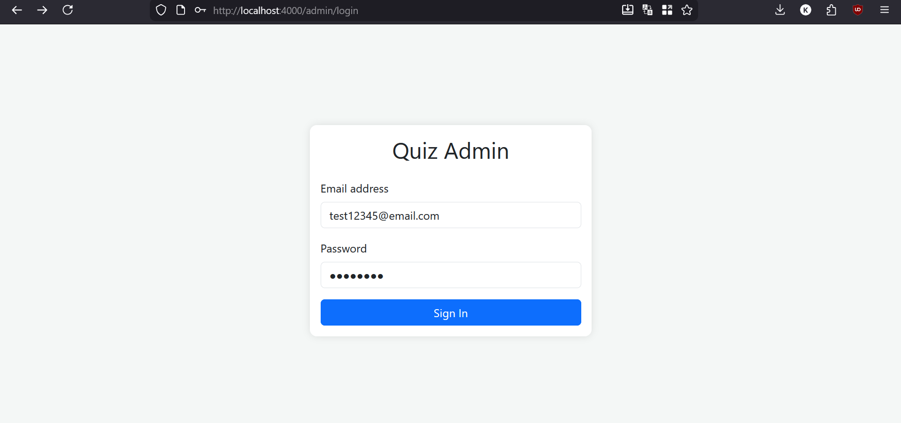
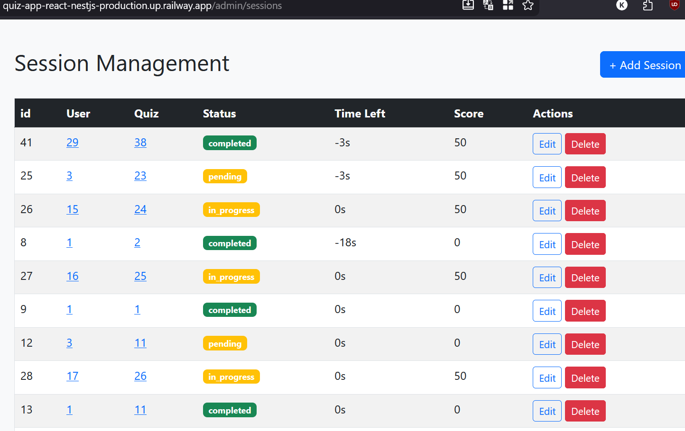
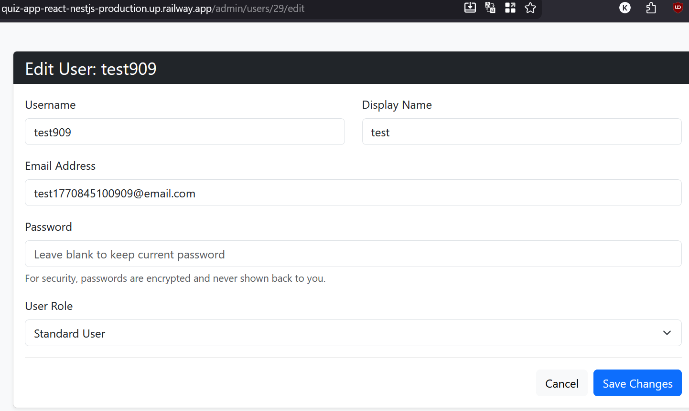
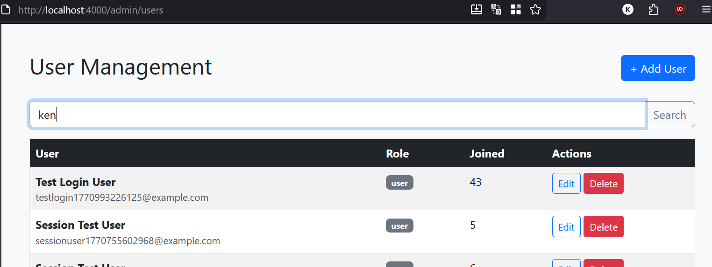
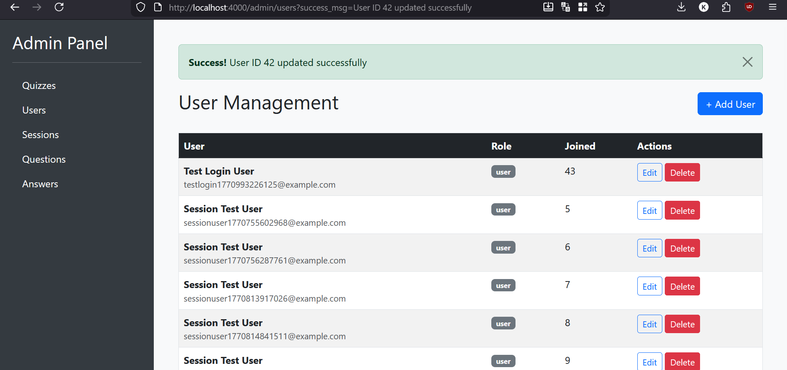

# Fullstack Quiz App - React & NestJS

## Deskripsi Proyek

Proyek ini adalah aplikasi kuis fullstack yang menggunakan React untuk frontend dan NestJS untuk backend. Aplikasi ini memungkinkan pengguna untuk mengikuti kuis, sementara admin dapat mengelola data melalui panel admin. Implementasi mencakup autentikasi, manajemen data dengan relasi database, pencarian, dan pagination.

## 1. Admin Panel dengan Manajemen Data dan Fitur Login

Admin panel dibuat menggunakan React dengan routing untuk halaman admin. Panel ini menyediakan fitur login untuk autentikasi admin, dan setelah login, admin dapat mengelola data dari dua tabel utama (misalnya, Users dan Quizzes).

Fitur utama:
- Login form dengan validasi
- Dashboard admin setelah login
- Menu sidebar untuk navigasi ke berbagai halaman manajemen

Demo dapat diakses di: https://quiz-app-react-nestjs-production.up.railway.app/admin/login  
Username: test12345@email.com  
Password: password12345



## 2. Relasi One to Many pada Dua Tabel

Dua tabel utama memiliki relasi one to many:
- **Quiz** (one) ke **Questions** (many): Satu kuis dapat memiliki banyak pertanyaan.
- **Users** memiliki relasi many-to-many dengan **Quiz** dan **Questions**. Tetapi disusun menjadi 2 tabel yaitu **Answers** yang memiliki relasi many-to-one dengan users dan questions, serta **Sessions** yang memiliki relasi many-to-one dengan users dan questions.

ERD menunjukkan relasi ini dengan foreign key.


## 3. Page untuk Menampilkan Data Dua Tabel

Halaman admin menampilkan data dari dua tabel dalam bentuk list dan detail:
- **List View**: Tabel dengan data quizzes, termasuk foreign key ke users.
- **Detail View**: Klik pada foreign key untuk melihat detail user terkait.

Akses quizzes menu dari sidebar atau langsung ke: https://quiz-app-react-nestjs-production.up.railway.app/admin/quizzes




## 4. Fitur Pencarian Data

Fitur pencarian diimplementasikan di backend menggunakan query builder untuk pencarian partial pada email dan username di tabel Users.

Kode dari `backend/src/modules/users/users.service.ts`:

```typescript
async findByQuery(query: string): Promise<User[]> {
  if (!query || query.trim() === '') {
    return this.findAll();
  }
  // use like operator for partial matches, and search both email and username
  return this.usersRepository.createQueryBuilder('user')
    .where('user.email ILIKE :query', { query: `%${query}%` })
    .orWhere('user.username ILIKE :query', { query: `%${query}%` })
    .getMany();
}
```

Frontend menampilkan searchbar di menu users.



Hasil pencarian untuk "ken": /admin/users?search=ken


## 5. Semua Respon Berbentuk Page

Semua API response menggunakan pagination untuk efisiensi, terutama untuk list data yang besar. Response berbentuk objek Page dengan properti seperti data, total, page, dll.

Contoh response sukses edit:



## 6. Pattern MVC

Aplikasi menggunakan pattern MVC (Model-View-Controller):

- **Model**: Entities dan DTOs (misalnya, User entity, Quiz entity) yang merepresentasikan data dan struktur database.
- **View**: Komponen React untuk UI (misalnya, halaman admin, form login) yang menampilkan data dan menerima input user.
- **Controller**: Di backend NestJS, controllers menangani HTTP requests, memanggil services, dan mengembalikan responses. Di frontend, komponen seperti AdminController mengelola state dan interaksi.

Implementasi MVC memisahkan concerns: Model untuk data, View untuk presentasi, Controller untuk logika routing dan handling requests. Ini membuat kode lebih terorganisir, mudah diuji, dan scalable.
