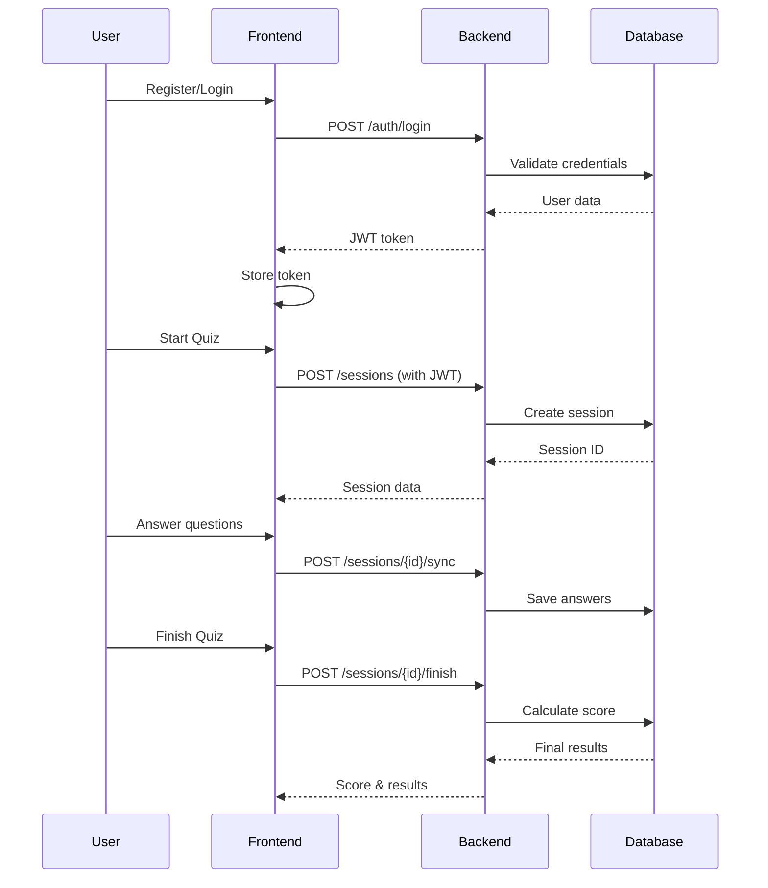

# Quiz App - React & NestJS


> A full-stack quiz application with real-time session management, built with React and NestJS.

## 📋 Table of Contents

- [Overview](#overview)
- [Architecture](#architecture)
- [Technology Stack](#technology-stack)
- [Getting Started](#getting-started)
  - [Prerequisites](#prerequisites)
  - [Installation](#installation)
  - [Environment Variables](#environment-variables)
  - [Running the Application](#running-the-application)
- [Project Structure](#project-structure)
- [API Documentation](#api-documentation)
- [Database Schema](#database-schema)
- [Authentication & Authorization](#authentication--authorization)
- [Testing](#testing)
- [Deployment](#deployment)
- [Contributing](#contributing)
- [License](#license)

---

## 🎯 Overview

Q KEN A adalah aplikasi kuis interaktif yang memungkinkan admin membuat kuis, pertanyaan, dan mengelola sesi kuis, sementara user dapat mengikuti kuis dengan sistem tracking waktu dan scoring otomatis.


## 🏗️ Architecture

**🎨 DIAGRAM: System Architecture Diagram**
```
Letakkan di sini: Detailed architecture showing layers (Presentation, Business Logic, Data Access)
Tool: C4 Model, PlantUML, atau Diagrams.net
```

### High-Level Architecture

```
┌─────────────────────────────────────────────────────┐
│                  Presentation Layer                  │
│              (React + TypeScript)                    │
│  - Components  - Hooks  - State Management          │
└─────────────────────┬───────────────────────────────┘
                      │ HTTP/REST
┌─────────────────────▼───────────────────────────────┐
│                  API Gateway Layer                   │
│              (NestJS Controllers)                    │
│  - Auth  - Quiz  - Questions  - Sessions  - Users   │
└─────────────────────┬───────────────────────────────┘
                      │
┌─────────────────────▼───────────────────────────────┐
│               Business Logic Layer                   │
│              (NestJS Services)                       │
│  - Business Rules  - Validation  - Processing       │
└─────────────────────┬───────────────────────────────┘
                      │
┌─────────────────────▼───────────────────────────────┐
│                Data Access Layer                     │
│              (TypeORM Repositories)                  │
│  - Entities  - Repositories  - Migrations           │
└─────────────────────┬───────────────────────────────┘
                      │
┌─────────────────────▼───────────────────────────────┐
│                   Database Layer                     │
│                  (PostgreSQL)
|                       (Supabase)                        │
└─────────────────────────────────────────────────────┘
```

**🎨 DIAGRAM: Component Diagram**
```
Letakkan di sini: Detailed component relationships and dependencies
Tool: PlantUML Component Diagram
```

---

## 🛠️ Technology Stack

### Backend
- **Framework:** NestJS 10.x
- **Language:** TypeScript 5.x
- **Database:** PostgreSQL
- **ORM:** TypeORM
- **Authentication:** JWT (jsonwebtoken, passport-jwt)
- **Validation:** class-validator, class-transformer
- **Testing:** Jest, Supertest
- **View Engine:** Handlebars (HBS)

### Frontend
- **Framework:** React 18.x
- **Language:** TypeScript
- **Build Tool:** Vite
- **Styling:** CSS Modules / Styled Components
- **State Management:** React Context / Redux (jika ada)
- **HTTP Client:** Axios / Fetch API

### DevOps & Tools
- **Version Control:** Git
- **Package Manager:** npm / yarn
- **API Testing:** Postman
- **Code Quality:** ESLint, Prettier

---

## 🚀 Getting Started

### Prerequisites

Pastikan Anda telah menginstall:
- Node.js (v18.x atau lebih tinggi)
- npm (v9.x atau lebih tinggi)
- PostgreSQL (v14.x atau lebih tinggi)
- Git

### Installation

1. **Clone repository**
```bash
git clone https://github.com/yourusername/quiz-app.git
cd quiz-app
```

2. **Install backend dependencies**
```bash
cd backend
npm install
```

3. **Install frontend dependencies**
```bash
cd ../frontend
npm install
```

### Environment Variables

#### Backend (.env)
```env
# Database
DATABASE_URL

# JWT
JWT_SECRET=your_jwt_secret_key
JWT_EXPIRATION=86400

# Server
PORT=3000
NODE_ENV=development

# Admin Credentials (optional for seeding)
ADMIN_EMAIL=admin@example.com
ADMIN_PASSWORD=admin123
```

#### Frontend (.env)
```env
API_URL=http://localhost:3000
APP_NAME=Quiz App
```

### Running the Application

#### Development Mode

**Backend:**
```bash
cd backend
npm run start:dev
```

**Frontend:**
```bash
cd frontend
npm run dev
```

#### Production Mode

**Backend:**
```bash
cd backend
npm run build
npm run start:prod
```

**Frontend:**
```bash
cd frontend
npm run build
npm run preview
```

The application will be available at:
- Frontend: http://localhost:5173
- Backend API: http://localhost:3000
- Admin Panel: http://localhost:3000/admin

---

## 📁 Project Structure

```
quiz-app/
├── backend/
│   ├── src/
│   │   ├── modules/
│   │   │   ├── admin/              # Admin panel controllers
│   │   │   ├── auth/               # Authentication & JWT
│   │   │   │   ├── dto/
│   │   │   │   ├── guards/
│   │   │   │   │   ├── jwt-auth/
│   │   │   │   │   └── roles/
│   │   │   │   ├── auth.controller.ts
│   │   │   │   ├── auth.service.ts
│   │   │   │   └── auth.module.ts
│   │   │   ├── users/              # User management
│   │   │   │   ├── entities/
│   │   │   │   ├── users.controller.ts
│   │   │   │   ├── users.service.ts
│   │   │   │   └── users.module.ts
│   │   │   ├── quiz/               # Quiz management
│   │   │   │   ├── entities/
│   │   │   │   ├── quiz.controller.ts
│   │   │   │   ├── quiz.service.ts
│   │   │   │   └── quiz.module.ts
│   │   │   ├── questions/          # Question management
│   │   │   │   ├── dto/
│   │   │   │   ├── entities/
│   │   │   │   └── ...
│   │   │   ├── answers/            # Answer management
│   │   │   │   └── ...
│   │   │   └── user-quiz-session/  # Session management
│   │   │       ├── dto/
│   │   │       ├── entities/
│   │   │       └── ...
│   │   ├── app.module.ts
│   │   └── main.ts
│   ├── views/                      # Handlebars templates
│   │   └── admin/
│   ├── test/                       # E2E tests
│   │   ├── auth-login.e2e-spec.ts
│   │   ├── auth-register.e2e-spec.ts
│   │   ├── quiz.e2e-spec.ts
│   │   ├── sessions.e2e-spec.ts
│   │   └── ...
│   ├── .env
│   ├── package.json
│   └── tsconfig.json
│
├── frontend/
│   ├── src/
│   │   ├── components/
│   │   ├── pages/
│   │   ├── services/
│   │   ├── hooks/
│   │   ├── utils/
│   │   ├── App.tsx
│   │   └── main.tsx
│   ├── public/
│   ├── package.json
│   └── vite.config.ts
│
├── .gitignore
├── README.md
└── LICENSE
### Authentication Endpoints


#### Register User
```http
POST /auth/register
Content-Type: application/json

{
  "email": "user@example.com",
  "password": "password123",
  "display_name": "John Doe"
}
```

#### Login
```http
POST /auth/login
Content-Type: application/json

{
  "email": "user@example.com",
  "password": "password123"
}

Response:
{
  "access_token": "eyJhbGciOiJIUzI1NiIs...",
  "user": {
    "id": 1,
    "email": "user@example.com",
    "role": "user"
  }
}
```

### Quiz Endpoints

#### Create Quiz (Admin)
```http
POST /quiz
Authorization: Bearer {admin_token}
Content-Type: application/json

{
  "name": "JavaScript Basics",
  "description": "Test your JavaScript knowledge"
}
```

#### Get All Quizzes
```http
GET /quiz
Authorization: Bearer {token}
```

#### Get Quiz Questions
```http
GET /quiz/{quizId}/questions
Authorization: Bearer {token}
```

### Session Endpoints

#### Create Session
```http
POST /sessions
Authorization: Bearer {user_token}
Content-Type: application/json

{
  "user_id": 1,
  "quizId": 1
}
```

#### Start Session
```http
PATCH /sessions/{sessionId}/start
Authorization: Bearer {user_token}
```

#### Sync Session (Save Answers)
```http
POST /sessions/{sessionId}/sync
Authorization: Bearer {user_token}
Content-Type: application/json

{
  "answers": [
    {
      "userId": 1,
      "questionId": 1,
      "userAnswer": true
    }
  ]
}
```

#### Finish Session
```http
POST /sessions/{sessionId}/finish
Authorization: Bearer {user_token}
Content-Type: application/json

{
  "answers": [
    {
      "userId": 1,
      "questionId": 1,
      "userAnswer": true
    }
  ]
}
```

**🎨 DIAGRAM: API Flow Diagram**




**📚 Untuk dokumentasi API lengkap, import [Postman Collection](./postman_collection.json)**

---

## 🗄️ Database Schema

**🎨 DIAGRAM: Entity Relationship Diagram (ERD)**
```
Letakkan di sini: Comprehensive ERD showing all tables and relationships
Tool: dbdiagram.io, MySQL Workbench, atau Draw.io
```

### Tables

#### users
```sql
CREATE TABLE users (
  id SERIAL PRIMARY KEY,
  email VARCHAR(255) UNIQUE NOT NULL,
  password VARCHAR(255) NOT NULL,
  display_name VARCHAR(255),
  role VARCHAR(50) DEFAULT 'user',
  created_at TIMESTAMP DEFAULT NOW(),
  updated_at TIMESTAMP DEFAULT NOW()
);
```

#### quiz
```sql
CREATE TABLE quiz (
  id SERIAL PRIMARY KEY,
  name VARCHAR(255) NOT NULL,
  description TEXT,
  created_at TIMESTAMP DEFAULT NOW(),
  updated_at TIMESTAMP DEFAULT NOW()
);
```

#### questions
```sql
CREATE TABLE questions (
  id SERIAL PRIMARY KEY,
  text TEXT NOT NULL,
  correct_answer BOOLEAN NOT NULL,
  quiz_id INTEGER REFERENCES quiz(id) ON DELETE CASCADE,
  created_at TIMESTAMP DEFAULT NOW(),
  updated_at TIMESTAMP DEFAULT NOW()
);
```

#### user_quiz_sessions
```sql
CREATE TABLE user_quiz_sessions (
  id SERIAL PRIMARY KEY,
  user_id INTEGER REFERENCES users(id) ON DELETE CASCADE,
  quiz_id INTEGER REFERENCES quiz(id) ON DELETE CASCADE,
  status VARCHAR(50) DEFAULT 'pending',
  score INTEGER DEFAULT 0,
  seconds_remaining INTEGER DEFAULT 0,
  current_question_index INTEGER DEFAULT 0,
  created_at TIMESTAMP DEFAULT NOW(),
  updated_at TIMESTAMP DEFAULT NOW()
);
```

#### answers
```sql
CREATE TABLE answers (
  id SERIAL PRIMARY KEY,
  user_id INTEGER REFERENCES users(id) ON DELETE CASCADE,
  question_id INTEGER REFERENCES questions(id) ON DELETE CASCADE,
  user_answer BOOLEAN NOT NULL,
  inserted_at TIMESTAMP DEFAULT NOW()
);
```

### Relationships
- One User has Many Sessions (1:N)
- One Quiz has Many Questions (1:N)
- One Quiz has Many Sessions (1:N)
- One Session has Many Answers (1:N)
- One Question has Many Answers (1:N)

**🎨 ERD Visual:**
```
[ERD](public\Quiz-App-Diagram.jpg)
```

---

## 🔐 Authentication & Authorization

**🎨 DIAGRAM: Authentication Flow Diagram**
```

```

### JWT Implementation

The application uses JWT (JSON Web Tokens) for stateless authentication:

1. **Registration/Login:** User credentials are validated and a JWT token is issued
2. **Token Structure:**
```json
{
  "email": "user@example.com",
  "sub": 1,
  "role": "user",
  "iat": 1234567890,
  "exp": 1234654290
}
```

3. **Authorization:** Every protected endpoint requires a valid JWT token in the Authorization header

### Role-Based Access Control (RBAC)

- **User Role:** Can take quizzes, manage own sessions
- **Admin Role:** Full access to all resources, admin panel access

### Guards

- **JwtAuthGuard:** Validates JWT token
- **RolesGuard:** Checks user role for admin-only endpoints
- **Public Decorator:** Marks endpoints that don't require authentication


---

## 🧪 Testing

### Running Tests

**Unit Tests:**
```bash
cd backend
npm run test
```

### Test Structure

```
test/
├── auth-login.e2e-spec.ts         # Authentication tests
├── auth-register.e2e-spec.ts      # Registration tests
├── quiz.e2e-spec.ts               # Quiz CRUD tests
├── questions.e2e-spec.ts          # Question management tests
├── sessions.e2e-spec.ts           # Session workflow tests
├── users.e2e-spec.ts              # User management tests
└── e2e-setup.ts                   # Test configuration
```
HASIL TESTING LULUS SEBAGAI BERIKUT
```
[e2e tests](public\e2e-tests.png)
```


### Postman

Dilakukan end-to-end testing menggunakan Postman sebagai berikut!

```
[postman]public\postman.png
```

Koleksi Postman bisa didapatkan pada [berikut](\backend\test\Quiz Sessions API.postman_collection.json)!

```
backend\test\Quiz Sessions API.postman_collection.json
```


### Admin Panel 

1. **Login Admin Panel**
```

```

2. **Create Quiz**
```

```

3. **Read Quiz**
```

```
4. **Edit Quiz**
```

```
5. **edit success**
```

```

### Test Coverage Areas

- ✅ Authentication (register, login)
- ✅ Quiz CRUD operations
- ✅ Question management
- ✅ Session lifecycle (create, start, sync, resume, finish)
- ✅ User management
- ✅ Answer submission
- ✅ Role-based access control

**🎨 DIAGRAM: Test Coverage Diagram**
```
Letakkan di sini: Visual representation of test coverage by module
Tool: Chart/Graph showing percentage coverage
```

---

## 🚀 Deployment

**🎨 DIAGRAM: Deployment Architecture Diagram**
```
Letakkan di sini: Infrastructure and deployment architecture
Tool: AWS Architecture Diagram, Cloud Architecture Diagram
```

### Production Deployment

```

- **Backend:**  Railway
Railway deployment: [HERE](https://quiz-app-react-nestjs-production.up.railway.app/)
- **Frontend:** Vercel
- **Database:** Supabase

---

